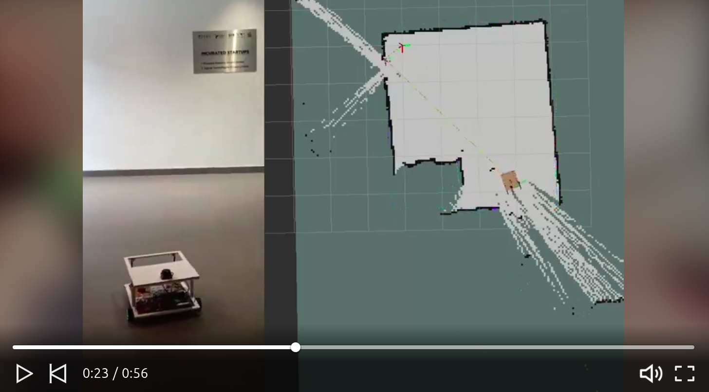
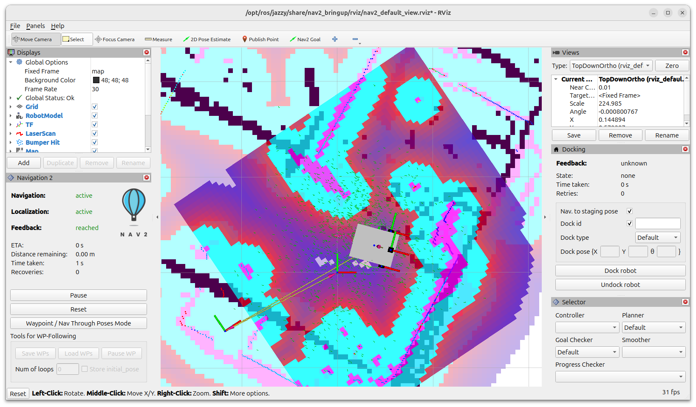

# SWEEBO-FLOOR CLEANING ROBOT
**Final year BTech Degree Project**

This project aimed to enhance the cleaning efficiency of robot by handling the litter waste materials like food-containers, plastic bottles etc. within the floor by the help of robotic arm and seggregate the waste materials like biodegradable and non biodegradable to the basin attached to the robot.

## Project Overview

* Built prototyoe model equipped with robotic arm, LiDAR and YOLOv8 based image detection.
* Shortlisted for Centre for Engineering Research and Development (CERD) funding.
* We also implemented foundational mapping and navigation using the ROS 2 framework and SLAM Toolbox.

## Watch the mapping video
 
*Video 1: Mapping of a room using SLAM toolbox.*

## Project Results

  
  
<em>Figure 1: a). Dimensions & Drawing, b). 3D Design.</em>

 

  
  
<em>Figure 2: a). Frame Design, b). Unified Robot Description Format (URDF) in RViz.</em>

 

  
  
<em>Figure 3: Mapping.</em>

 

  
  
<em>Figure 4: Navigation.</em>

 

  
  
<em>Figure 5: Image processing and Robotic arm.</em>

 

  
  
<em>Figure 6: Prototype of the Sweebo cleaning robot.</em>

## Technologies Used

* ROS 2
* micro-ROS
* YOLOv8
* LiDAR
* SLAM Toolbox
* Nav2

## Contributors
1. [Afsalu Rahman C](https://www.linkedin.com/in/afsalu-rahman-c/)
2. [Asif Saif S](https://www.linkedin.com/in/asif-saif-764aa42a4/)
3. [Amjad Khaleel Farhan](https://www.linkedin.com/in/amjad-khaleel-farhan-97290b228/)
4. [Muhammed Irshad](https://www.linkedin.com/in/muhammed-irshad-b58b9528a/)
## Future Scope

* The future scope of SWEEBO lies in integrating cognitive robotics, enabling it to perceive, learn, and adapt to dynamic environments for efficient debris collection.
* By leveraging AI, deep learning, and sensor fusion, SWEEBO can enhance object detection, autonomous navigation, and decision-making.

> **Developed as part of Major Project work at TKM College of Engineering, Kollam (2025).**

