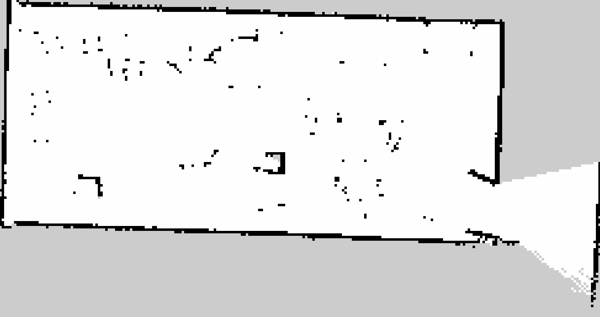
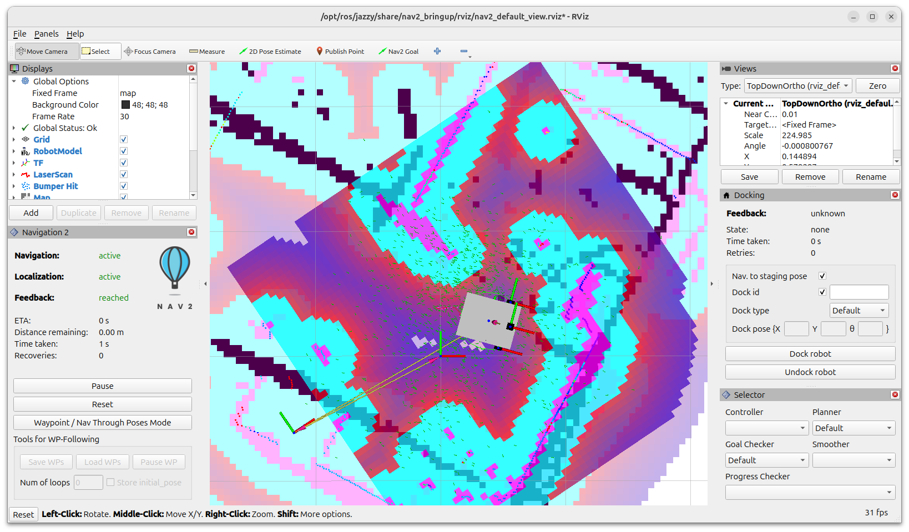

# SWEEBO-FLOOR CLEANING ROBOT
**Final year BTech Degree Project**

This project aims to enhance the cleaning efficiency of robot by handling the litter waste materials like food-containers, plastic bottles etc. within the floor by the help of robotic arm and seggregate the waste materials like biodegradable and non biodegradable to the basin attached to the robot.

## Project Overview

* Built prototyoe model equipped with robotic arm, LiDAR and YOLOv8 based image detection.
* Shortlisted for Centre for Engineering Research and Development (CERD) funding.
* Currently enhancing the robot’s mapping and navigation capabilities using the SLAM Toolbox, the ROS 2 Navigation framework, and sensor fusion.

## Phase 1 Results

1. Data Preprocessing and Standardization
2. GMM-based Synthetic Data Generation
3. Model Training and Hyperparameter Tuning
4. Model Evaluation using MSE and R² Score
5. SHAP Analysis for Feature Importance

*Figure 1: Phase 1, Project Works.*

##  Ongoing work

*Figure 2: a). Diamensions & Drawing, b). 3D Design.*

*Figure 3: a). Frame Design, b). Unified Robot Description Format (URDF) in RViz.*

*Figure 4: Mapping.*

*Figure 5: Navigation.*

## Technologies Used

* ROS 2
* micro-ROS
* YOLOv8
* LiDAR
* SLAM Toolbox
* Nav2

## Future Scope

* The future scope of SWEEBO lies in integrating cognitive robotics, enabling it to perceive, learn, and adapt to dynamic environments for efficient debris collection.
* By leveraging AI, deep learning, and sensor fusion, SWEEBO can enhance object detection, autonomous navigation, and decision-making.

> **Developed as part of Major Project work at TKM College of Engineering, Kollam (2025).**

